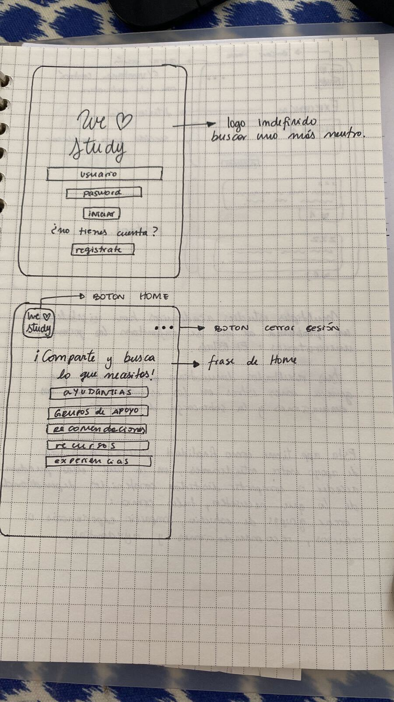
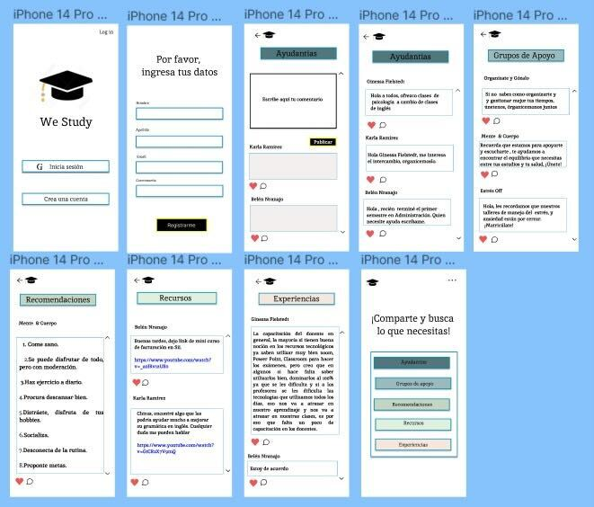
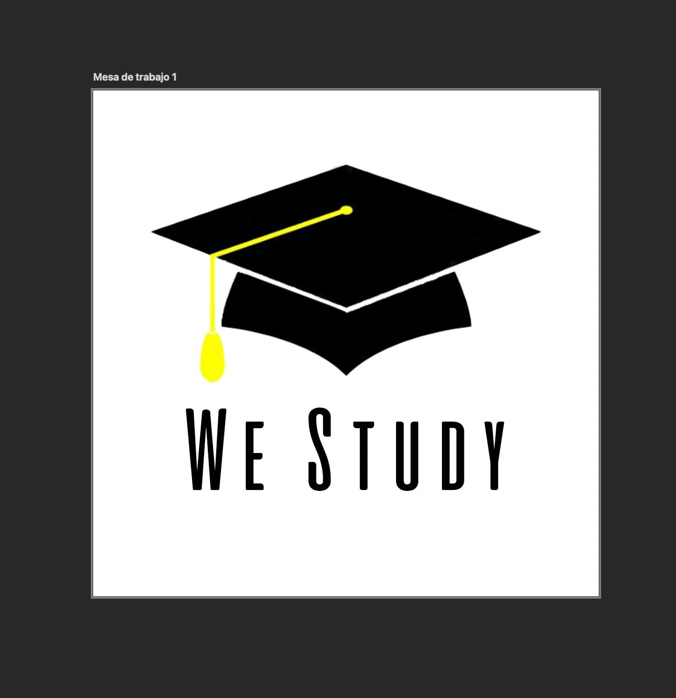

# **Social-Network: WE STUDY**

### ***Descripcion de la app***
* Multiples estudios academicos han visibilizado un problema al que se enfrentan los jovenes estudiantes: El Estrés.
Sus resultados demuestran que el factor que genera mas estres en los estudiantes son las evaluaciones y sobrecarga de trabajo.
We Study es una app que tiene como finalidad crear una red de apoyo para los usuarios/estudiantes, en la cual ellos puedan acceder ya sea para ver publicaciones o compartir contenido como: recursos, información relevante respecto a temas como becas, postulaciones. Crear grupos de ayudantias, o simplemente compartir experiencias, todo con la finalidad de poder contribuir y ser un aporte dentro de una comunidad que busca hacer de los estudios algo mas grato.

### ***Principales usuarios del producto***
* los usuarios principalmente son estudiantes universitarios que necesiten algun tipo de recurso o contacto dentro de las mencionadas en la descripción de la app.

### ***¿Cuáles son los objetivos de estos usuarios en relación con el producto?***
* Que el usuario/estudiante pueda acceder a información relevante respecto a materias, carreras, experiencias, o datos que pueda encontrar dentro de las publicaciones.

### ***¿Cuándo utilizan o utilizarían el producto?***

* Los usuarios/estudiantes ingresaran a la app para obtener la información deseada. Además podrán compartir su propio contenido, poder dar like a información o publicaciones que deseen

# *Historias de usuario*

### ***Historia de Usuario 1***

Yo: Como estudiante universatario, con un nivel del alto de estrés y poca información o grupos de apoyo, me gustaría poder contar con una red no solo academica si no también emocional, de esta manera conocer mas personas que esten sintiendo lo mismo que yo y poder contar con reales aportes tanto academicos como , de salud y equilibrio.

Quiero: Poder registrarme, creando una cuenta para acceder a esta red de apoyo

Para: Poder ingresar de manera segura, interactuar y tener apoyo y contensión de más estudiantes.

Criterios de aceptación:
El usuario tendrá un formulario de registro en donde indicará su nombre y apellido, correo electrónico, contraseña y un botón para registrarse (registrar)
La contraseña estara oculta cuando el usuario la escriba
El usuario no podra enviar el formulario si algun campo esta vacio
Es responsive, puede visualizarse y realizarse fácilmente desde cualquier dispositivo

### ***Historia de Usuario 2***

Yo: como estudiante universitario ya registrado quiero estar mas al día con contenidos sobre becas o postulaciones para certificados.

Quiero: Poder iniciar sesión con mi correo, y poder ver los post ordenados en forma descendente e interactuar con dando like con las publicaciones que me interesen.                                                                      
Para: Lograr tener mas conocimiento sobre las distintas oportunidades academicas que existen
Criterios de aceptación:
El usuario tendrá un formulario de inicio de sesión en el cual debe ingresar un mail válido ya registrado.
el usuario podra dar like en las publicaciones que quiera.
La contraseña aparecerá de manera secreta (****) cuando el usuario la escriba
Es responsive, puede visualizarse y realizarse fácilmente desde cualquier dispositivo

### ***Historia de Usuario 3***

Yo: Como estudiante universitario ya registrado quiero publicar sobre las ayudantias que puedo ofrecer en distintas materias que manejo

Quiero: Realizar un post con la descripción de mi ayudantia, poder compartirlo y que aparezca en orden (que se actualice en tiempo real la publicación)                                                                                          
Para: Poder ayudar a mas estudiantes dentro de esta red

Criterios de aceptación:
El usuario tendrá un formulario de inicio de sesión en el cual debe ingresar un mail válido ya registrado.
La contraseña aparecerá de manera secreta (****) cuando el usuario la escriba
El usuario podra ingresar su post en un espacio de texto y cliquear el boton de publicar para generar el contenido actualizado en tiempo real
Podra eliminar o editar el post mencionado
Es responsive, puede visualizarse y realizarse fácilmente desde cualquier dispositivo

# *Diseño de interfaz de usuario*

### ***Prototipo de baja fidelidad***

### ***Prototipo de Alta fidelidad***

### ***Prototipo de Logo App***

